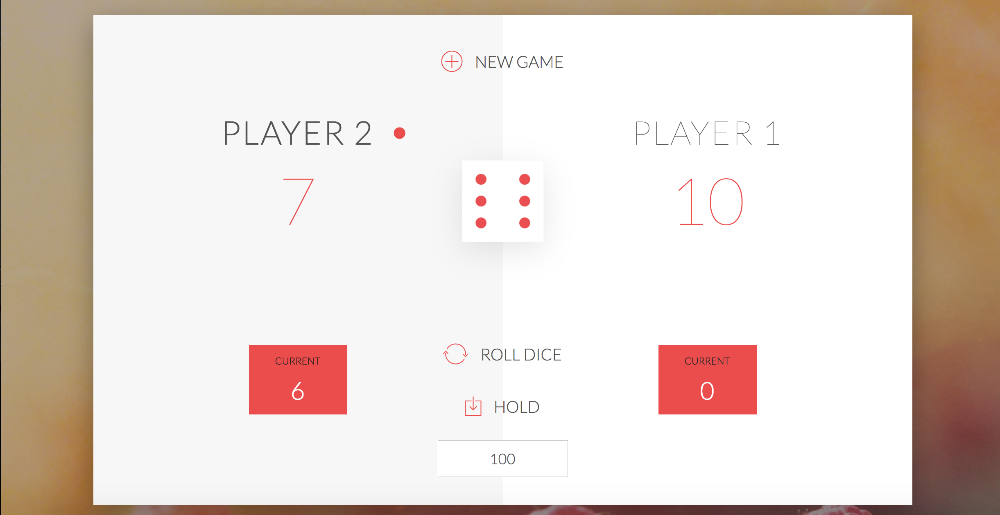

# Dice-Game
A game to play with a friend based on dice logic.

# Rules
1) Enter a winning score on the centre bottom of the screen  
2) Roll the dice  
3) The current score (in red box) is cumulative of your dice rolls  
4) Hold your score if you wish to save it  
5) If you roll a 1, you lose your current score and it's your opponents turn  
6) If you roll two 6's in a row, you lose your total score and it's your opponents turn  

